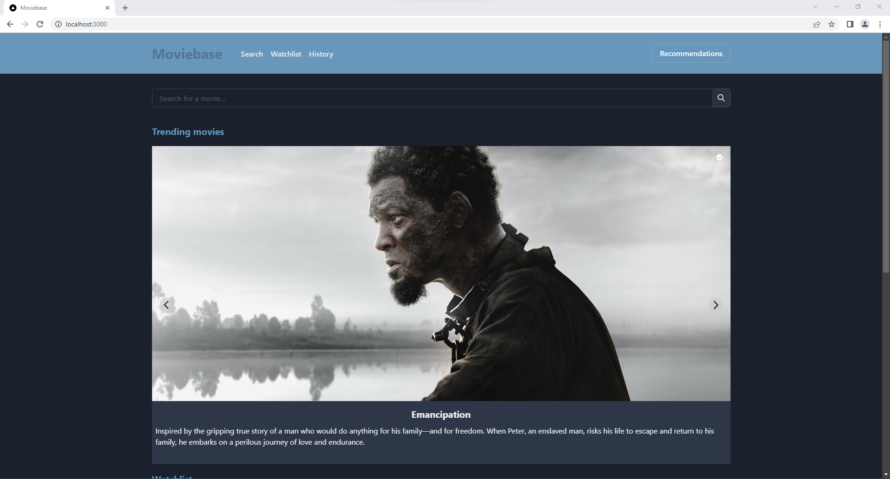
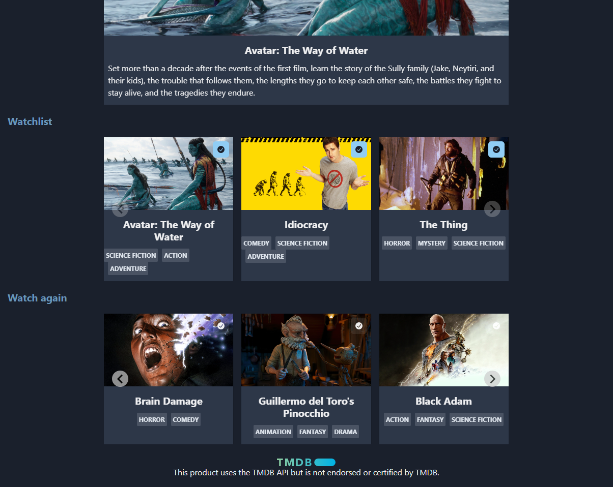
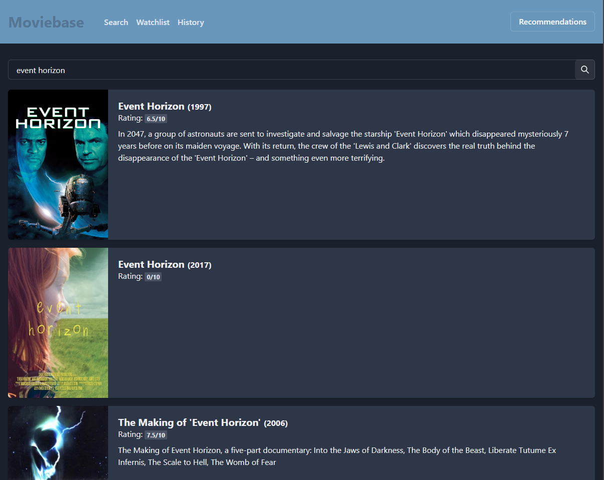
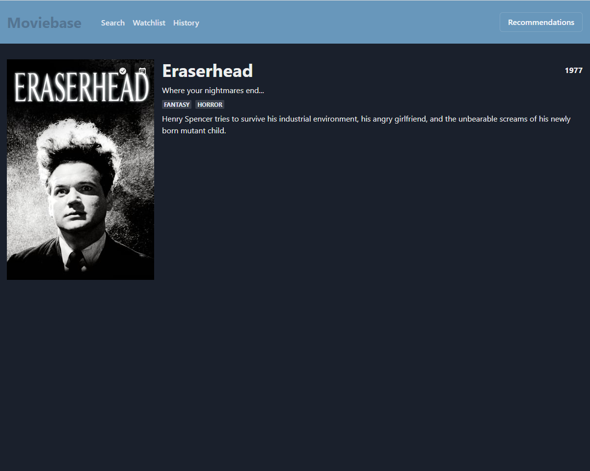
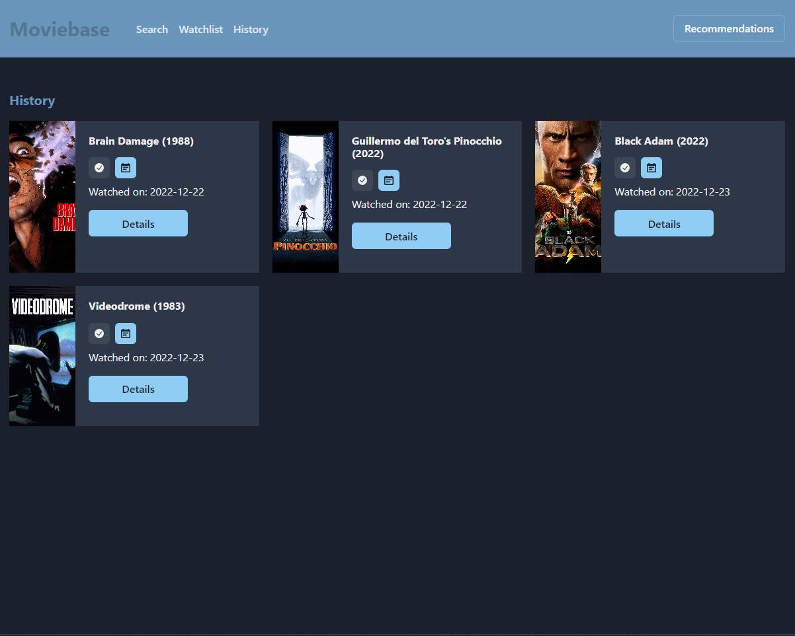

# Moviebase

Search

Movie Page

History

Setup:

    Clone this repository
    Copy .env.example and rename it to .env.local
    Change the environment variables from .env.local
    Run npm install
    Run npm run build
    Run npm run start
